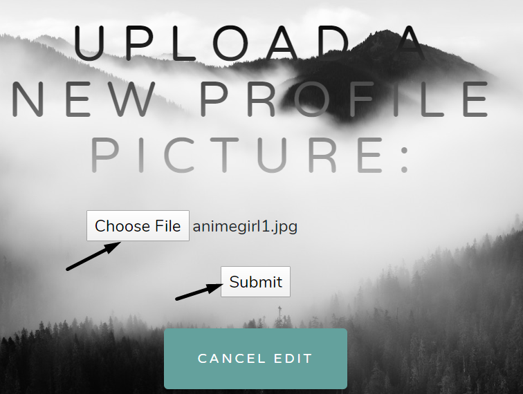
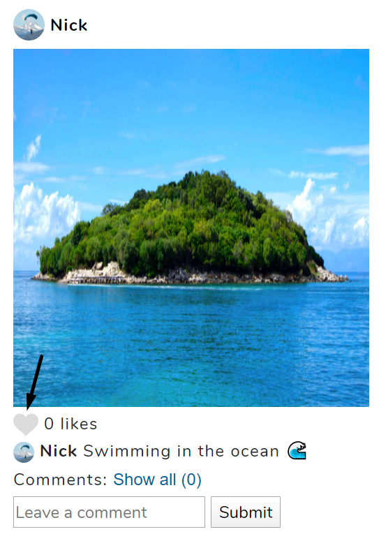

# Pic5 Screenshots

## Account Creation
To make an account, a user can either click on "Create an Account" on the upper right corner or on "Don't have an account?" in the Sign In portion.

## Sign In
Users can click on the "SIGN IN" button to redirect to the Sign In page, which is shown previously under Account Creation.

## Edit Profile Picture
Users can edit their profile picture by clicking on the default picture.

Users can choose a profile picture of their choice by clicking "Choose File" and "Submit".

Final result:

## Edit Profile
Users can customize their profile by clicking on "Edit Profile".

Users can add a bio by typing in the textarea and clicking on "Submit".

Users can also customize their background by clicking "Edit Background".

Users can select a background photo by choosing a file and clicking on "Submit"

Users can also select a background color and a text color. To confirm changes, users click on "SAVE".
 

Final result:

## Post Pictures
Users can post a photo by clicking on "Post Photo".

Users can select a picture they want to post by clicking on "Choose File". They can add an caption (optional). To confirm, users click on "Submit".

Final result:

## Delete Pictures
Users can delete a picture they posted by clicking on the 3 vertical dots associated with the desired picture to delete, and click on "Delete".

## Search Users
Users can search for a user.

All associated searched users are displayed in a search result page and can be clicked to redirect to their profile page.

## Follow Users
Users can follow another user by clicking on the "FOLLOW" button. 

## Unfollow Users
Users can unfollow another user by clicking on the "UNFOLLOW" button.

## Like Pictures
Users can like a picture by clicking on the heart.

## Unlike Pictures
Users can unlike a picture they have liked by reclicking on the heart.

## Comment on Pictures
Users can comment on a picture by typing in the text input and clicking on "Submit"

Final result:

## News Feed
Users can view all picture posted by the users they follow by clicking on "Feed".

How the feed looks like:

## Mini Icons
A small version of the users' profile pictures are displayed alongside their posted pictures and comments.

On the feed, those icons are clickable and redirects to the corresponding user.

## Followers list
Users can view the list of followers on a user's profile page by clicking on "Followers". The users on the list can be clicked to redirect to their profile page.

The list:

## Following List
Users can view the list of following on a user's profile page by clicking on "Following". The users on the list can be clicked to redirect to their profile page.

The list:

## Focused Picture
Users can also click on a picture to have a focused view on it.

How a focused image looks like (note: image is too big to fit inside a screenshot):

## Logout
Users can logout by clicking on "Logout".

